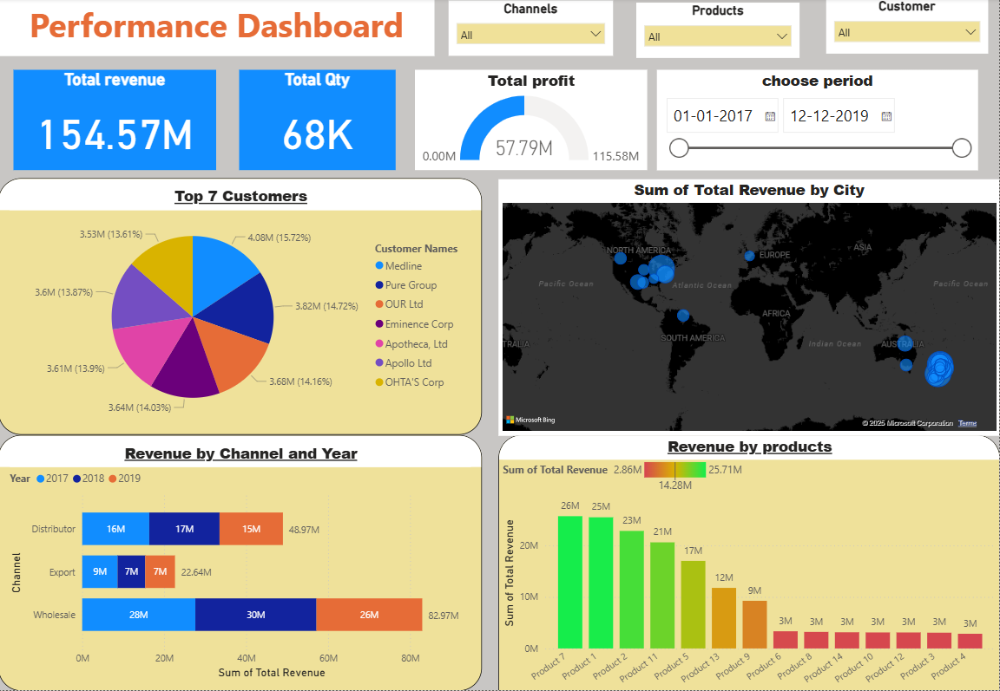

# Power BI Performance Dashboard

A clean, interactive **Performance Dashboard** built in **Power BI** to monitor revenue, quantity, and profit across channels, products, customers, geographies, and time.



## ✨ Highlights
- **KPIs:** Total Revenue, Total Quantity, Total Profit
- **Slicers:** Channel, Product, Customer, Date Range
- **Visuals:**
  - *Top 7 Customers* (pie)
  - *Revenue by City* (map)
  - *Revenue by Channel & Year* (stacked bars)
  - *Revenue by Products* (bar)
- Built for quick executive insights and drill-down analysis.

## 📁 Repository Structure
```
powerbi-performance-dashboard/
├── assets/
│   └── dashboard.png         # Dashboard preview image
├── dashboard/                # Place your .pbix here
│   └── Performance_Dashboard.pbix  # (add your Power BI file)
├── LICENSE
└── README.md
```

> **Note:** Add your actual `.pbix` to `dashboard/Performance_Dashboard.pbix` before pushing.

## 🚀 Getting Started
1. Open the `.pbix` in **Power BI Desktop** (Windows).
2. If your model uses external data sources, update the **Data Source Settings** and refresh.
3. Explore using the slicers and visuals to filter by channel, product, customer, and date.

## 🧭 How to Use the Dashboard
- View high-level KPIs at the top.
- Filter with slicers (channels, products, customers, dates).
- Use the **map** to understand geographic revenue distribution.
- Compare performance across **years & channels** with the stacked bars.
- Identify top-performing products and customers.

## 🧱 Tech
- Microsoft **Power BI Desktop**
- Data Model: Star-schema style (facts + dimensions) recommended

## 🧪 Ideas for Next Iteration
- Add DAX measures for **YoY%** and **MoM%** growth
- Conditional formatting for product/category performance
- Bookmark-driven storytelling view
- Row-level security (RLS) for user-specific access

## 📜 License
This project is open-sourced under the **MIT License** (see `LICENSE`).

## 🙌 Author
- Replace with your name · [LinkedIn](https://www.linkedin.com/) · Email: yourname@example.com

---

If you find this useful, please ⭐ the repo!
